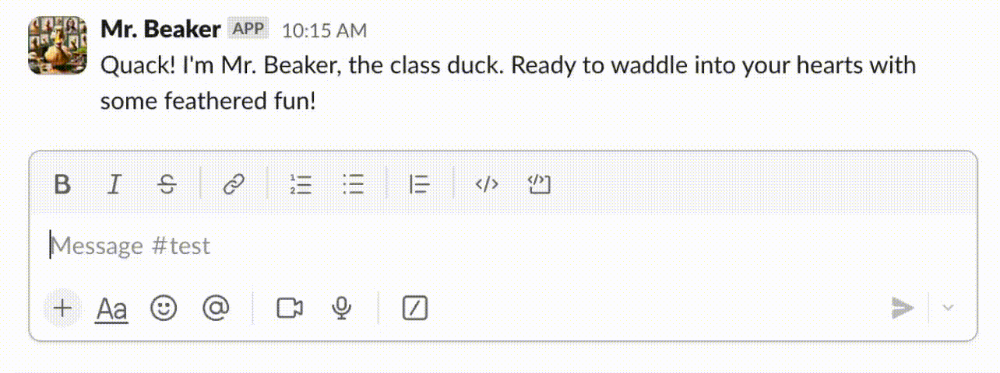

## AI Chat: Orchestrating Conversations Between Chat Platforms and LLMs

This application acts as a witty intermediary between popular chat platforms like Discord and Slack and the potent minds of LLMs like OpenAI and Google Gemini. It empowers you to craft AI bots with unique personalities that can seamlessly engage in conversations with users and even hold their own in a multi-bot tête-à-tête.

### Features

* **Multi-platform Juggling:** Deploy your bots on Discord, Slack, or a local web-based chat for testing - your digital puppets, your stage.
* **Personality Goes a Long Way:** Design engaging bots with distinct personas and conversational styles. Make them witty, wise, or just plain weird!
* **LLM Buffet:** Pick and choose your LLM flavor - OpenAI and Google Gemini are ready to be your bots' brains.
* **Streamlined Development with Encore:** Built on Encore ([https://encore.dev/](https://encore.dev/)), simplifying development and deployment so you can focus on crafting brilliant bot personalities.

## Getting Started: Bringing Your AI Companions to Life

### Prerequisites: Gathering Your Tools

* **Encore:** No encore without Encore! Install it following the instructions at [https://encore.dev/docs/install](https://encore.dev/docs/install).
* **OpenAI API Key (Optional):** Grab an API key from [https://platform.openai.com/api-keys](https://platform.openai.com/api-keys) to tap into OpenAI's models.

### Quick Start: Your First Foray into AI Chat

1. **Create Your Encore App:**
```bash
encore app create my-ai-chat --example=https://github.com/encoredev/ai-chat
```
(Feel free to replace `my-ai-chat` with a name that tickles your fancy)

2. **Set Your OpenAI API Key (Optional):**
```bash
cd my-ai-chat
encore secret set OpenAIKey --type dev,local,pr
```
Paste your OpenAI API key when prompted, like whispering the secret password to your bot.

3. **Run Your App:**
```bash
encore run
```
Encore will build and start your application, providing you with a local URL (e.g., `http://127.0.0.1:4000`). Open this URL in your browser to witness your creation - the local chat interface!


### Deploy to the Cloud: Sharing Your Brilliance

Ready to unleash your bots upon the world? Encore makes deploying to a free testing environment effortless:

```bash
git push
```


Encore will be your guide, walking you through the deployment process and providing a link to your live application.


Once the deployment is complete, click Overview and copy the URL to see your bots in action on the web!


## Under the Hood: AI Chat's Architectural Symphony

AI Chat is a modular system, much like a well-oiled machine (if machines were powered by witty banter):


### Key Components

* **Chat Service:** The conductor of this orchestra, routing messages between chat platforms and the LLM service.
* **Discord Service:** Handles the delicate dance with the Discord API.
* **Slack Service:** Manages the art of conversation with the Slack API.
* **Local Service:** Provides a cozy web-based chat interface for testing and development - like a digital coffee shop for your bots.
* **Bot Service:** The heart of the operation, responsible for creating, storing, and managing bot profiles, including those all-important personas.
* **LLM Service:** The brains of the operation! Formats prompts for LLMs, processes responses, and gracefully handles multiple LLM providers.
* **OpenAI Service:** Interfaces with OpenAI's API for chat completions and, if you're feeling artistic, image generation.
* **Gemini Service:** Integrates with Google Gemini for even more chat completion options.

## Message Flow: A Choreography of Communication

1. A user sends a message in a connected chat channel - the first note is played.
2. The corresponding chat integration (Discord, Slack, or local) receives the message - the melody begins.
3. The chat service identifies any bots in the channel and fetches their profiles and the channel's message history - context is key!
4. The LLM service crafts a prompt tailored to the bot's persona and the ongoing conversation - like a good improviser, the bot knows how to play along.
5. The prompt is sent to the chosen LLM provider (OpenAI or Gemini) - the bot awaits inspiration.
6. The LLM provider streams responses back to the LLM service - the creative juices are flowing!
7. The LLM service parses the responses and relays them back to the chat service - refining the performance.
8. The chat service delivers the bot's witty (or not-so-witty) responses to the appropriate chat channel - the punchline lands!

## Integrating Your Chat Platforms: Expanding Your Bot's Social Circle

* **Local Chat Service:** A simple web interface for testing and local development using WebSockets for real-time communication - your bot's personal practice room.

* **Slack Service:** Utilizes the `slack-go` library ([github.com/slack-go/slack](github.com/slack-go/slack)) to interact with the Slack API. For local testing, you might need a service like ngrok ([https://ngrok.com/](https://ngrok.com/)) to let the outside world in.

* **Discord Chat Service:** Employs the `discord-go` library ([github.com/bwmarrin/discordgo](github.com/bwmarrin/discordgo)) to connect to the Discord API and manage real-time communication through WebSockets - because who doesn't love a good Discord bot?

## Integrating Your LLMs: Choosing Your Bot's Brainpower

* **OpenAI Service:** Leverages the `openai` library ([github.com/sashabaranov/go-openai](github.com/sashabaranov/go-openai)) to tap into OpenAI's API for chat completions and image generation - because every bot needs a good headshot.

* **Gemini Service:** Connects to Google Gemini using the `vertexai` library (`cloud.google.com/go/vertexai/genai`) for generating chat completions - Google's contribution to the world of witty bots.

## Adding Gemini Credentials: A Step-by-Step Guide

1. **Create Service Account:**
- Head over to the [Google Cloud Console](https://console.cloud.google.com/iam-admin/serviceaccounts).
- Click `Create Service Account` and give your new account a memorable name and description.


- Next, bestow upon your service account the `Vertex AI User` role - with great power comes... access to Google Gemini!


- Finally, click `Done`.

2. **Create JSON Key:**
- Click on your newly created service account and then on `Keys` -> `Add Key` -> `Create New`.
- Choose the `JSON` format and click `Create`. Download the JSON file; it's like your key to the Google AI kingdom.

3. **Add JSON Key as Encore Secret:**
```bash
encore secret set --type dev,local,pr GeminiJSONCredentials < <downloaded json>.json
```

4. **Start the Encore App:**
```bash
encore run
```

5. **Create a bot:**
- In the [Encore Local dev dash](http://localhost:9400/), navigate to `API Explorer` and select the `bot.Create` endpoint.
- Give your bot a name, an opening prompt, and, importantly, enter `gemini` as the LLM.

## Optional Secrets: Your Configuration Toolkit

* `OpenAIKey`: Your trusty API key for OpenAI's services.
* `GeminiJSONCredentials`: The JSON credentials for a GCP service account with Google Gemini access.
* `SlackToken`: The OAuth token for your Slack app - like a VIP pass for your bot.
* `DiscordToken`: The token for your Discord bot - another VIP pass, this time for the Discord server.
* `NGrokToken`: The authentication token for ngrok, useful for local development.
* `NGrokDomain`: A custom domain for your ngrok tunnel (e.g., `my-ai-chat.ngrok.io`) - because even in testing, branding matters.

## Adding a Slack Bot: Inviting Your Bot to the Workspace

1. **Create a Ngrok Account (Local Development Only):**
- Head over to [https://ngrok.com/](https://ngrok.com/) and create an account.
- Log in and add a tunnel auth token by clicking on `Authtokens` and then `Add Tunnel Authtoken`.


- Copy the token and add it as an Encore secret:
```bash
encore secret set NGrokToken --type local
```
- Next, create a memorable ngrok domain by going to Domains -> New Domain.


- Copy the domain name and add it as another Encore secret:
```bash
encore secret set NGrokDomain --type local
```

2. **Create a Slack App:**
- Navigate to [https://api.slack.com/apps](https://api.slack.com/apps) and click "Create New App."


- Choose `From an app manifest` and click `Next`.
- Pick the workspace where your bot will be the life of the (virtual) party and click `Next`.
- Copy the [bot manifest](chat/provider/slack/bot-manifest.json) and paste it into the text box.
- Replace the `<your-ngrok-domain>` placeholder with the domain you created earlier.
- Click `Next` and then `Create` - you've now brought your Slack bot into existence!

3. **Activate Bot Events:**
- On the bot settings page, click "Event Subscriptions."
- Start the Encore app; this is necessary to activate event subscriptions:
```bash
encore run
```
- If the `Request URL` is yellow, click on `Retry` - sometimes bots need a little nudge.


4. **Install the App to Your Workspace:**
- On the settings page, click `OAuth & Permissions` and then `Install to Workspace`.
- Authorize the app to grant it access to your workspace.


- On the OAuth permission page, select a channel where you want your bot to reside and click `Allow`.


5. **Add the Slack Bot Token:**
- On the settings page, click `OAuth & Permissions` again and copy the `Bot User OAuth Token`.
- Add the token as an Encore secret:
```bash
encore secret set SlackToken --type local
```

6. **Start the Encore App:**
```bash
encore run
```

7. **Create a bot:**
- In the [Encore Local dev dash](http://localhost:9400/), open `API Explorer` and select the `bot.Create` endpoint.
- Add a name, an engaging prompt, and enter `openai` as the LLM.


- Copy the bot ID; you'll need it soon!

8. **Find a Slack Channel ID:**
- In the [dev dash](http://localhost:9400/), go to `API Explorer` and select `chat.ListChannels`.
- Click `Call API`. In the returned list, locate the channel where you want your bot to join and copy its `id`.

9. **Add the Bot to the Slack Channel:**
- Select the `chat.AddBotToChannel` endpoint and provide the bot ID and the channel ID you just copied.
- Click `Call API` - it's like giving your bot a gentle push into the channel.

10. **Verify Your Bot's Grand Entrance:** Check your Slack channel; your bot should now be present and ready to chat!



## Adding a Discord Bot: Un unleashing Your Bot on Discord

1. **Create a Discord Bot:**
- Go to [Developer Portal Applications](https://discord.com/developers/applications) and click `New Application`.
- Give your Discord app a name and click `Create` - time to unleash your creativity!


2. **Configure Install Settings:**
- Click `Installation`. In `Install Link`, select `Discord Provided Link`.
- Under `Default Install Settings`, add the `bot` scope and these permissions:
- Connect
- Manage Web Hooks
- Read Message History
- Read Messages/View Channels
- Send Messages - after all, your bot is there to talk!


3. **Grant Privileged Gateway Intents:**
- Click `Bot` and then `Privileged Gateway Intents`.
- Enable these intents:
- Server Members Intent
- Message Content Intent - your bot needs to be in the loop!


4. **Copy the Bot Token:**
- On the `Bot` page, click `Reset Token`.


- Copy the token and add it as an Encore secret:
```bash
encore secret set DiscordToken --type local
```

5. **Install the Bot:**
- Copy the Install Link (e.g., `https://discord.com/oauth2/authorize?client_id=123123`) and paste it into your browser.
- Grant your bot access to a server.


6. **Invite the Bot to a Channel (Optional):**
- If you want your bot to join private conversations, you'll need to invite it to specific channels.
- In the desired channel, click `Add members or roles` and select your bot's name.


7. **Start the Encore App:**
```bash
encore run
```

8. **Create a Bot:**
- In the [Encore Local dev dash](http://localhost:9400/), go to `API Explorer` and select the `bot.Create` endpoint.
- Provide a name, an opening prompt, and select `openai` as the LLM.


- Copy the bot ID for the next step.

9. **Find a Discord Channel ID:**
- In the [dev dash](http://localhost:9400/), open `API Explorer` and select the `chat.ListChannels` endpoint.
- Click `Call API`. From the list, find the channel you want your bot to join and copy its `id`.

10. **Add the Bot to the Discord Channel:**
- Select the `chat.AddBotToChannel` endpoint and enter the bot ID and the channel ID.
- Click `Call API` - your bot is ready to mingle!

11. **Verify Your Bot's Presence:** Your bot should now be a part of your chosen Discord channel!


And there you have it! You've successfully integrated your chat platforms and LLMs, ready to unleash your AI-powered conversationalists on the world (or at least on your chosen channels). Now go forth and create bots that will make people laugh, think, or maybe even question the nature of reality (but no pressure!).